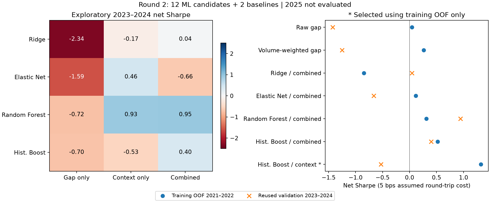

# 第 2 轮：机器学习与手工跳空因子对照

更新日期：2026-10-08。状态：12 个新模型综合信号候选实测完成，另有 2 个手工因子对照；累计使用 2/4 轮。探索期随机森林组合信号较好，但事先选出的模型失败，尚无独立验证合格因子。2025 留出期未评分，未接入交易。

来源：用户提出机器学习挖掘及不同思路/因子差异比较要求；[首轮报告](README.md)、[固定方案](plan-ml.json)、[运行代码](ml.py)、[结果](round-02/summary.json)。模型原理与时序验证参考 scikit-learn 官方文档，链接见下文，核查日 2026-10-08。

## 主要比较结果

使用相同 RB/AG/AU 单合约日线、收盘信号、次日开盘至收盘收益、三个品种各 1/3 名义资金份额、5 bps 假设开平总成本。下面为 **2023–2024 已查看过的探索性对照期**净夏普，不能视为新独立验证。

| 模型思路 | 仅跳空 16 特征 | 仅背景 8 特征 | 合并 24 特征 |
|---|---:|---:|---:|
| 岭回归 | -2.34 | -0.17 | 0.04 |
| Elastic Net | -1.59 | 0.46 | -0.66 |
| 随机森林 | -0.72 | 0.93 | 0.95 |
| 直方图梯度提升树 | -0.70 | -0.53 | 0.40 |

同口径手工原始跳空净夏普 -1.42、成交量加权跳空 -1.25。为公平比较，这次全部信号都用 2021–2022 共同训练 OOF 样本校准阈值；首轮用 2020–2022 校准，故不能把本表与首轮 -1.33 的差别归因于新模型，首轮原始记录保持不变。各模型在探索期的交易次数不同，未用探索期分位数强行固定交易频率。



[可导出的 PDF](comparison-02/method-comparison.pdf) · [完整指标](round-02/metrics.csv) · [逐日收益](round-02/comparison-daily.csv)

本次观察：仅跳空特征的四个模型均没有正净夏普；背景特征对多个模型更有帮助。随机森林的合并/背景夏普只差约 0.01，因此没有充分证据说“显式跳空特征是主要收益来源”。梯度提升合并特征在本期优于背景，但不能把四个固定参数模型的结果推广为所有机器学习方法的结论。

## 事先能选中吗

选择只看 2020–2022 内滚动得到的 OOF 分数，要求平均品种 Rank IC>0、日均净收益>0、至少 100 笔，再按净夏普排序。12 个候选中 4 个满足初筛，唯一选出的 `hist_boost__context` 训练 OOF 夏普 1.32、Rank IC 0.0718；进入探索期后夏普 -0.53、累计模型收益 -4.85%，未过对照门槛。

随机森林合并信号在探索期累计模型收益 7.62%、净夏普 0.95、Rank IC 0.0386、交易 180 次、最大回撤 -2.63%；但其训练 OOF Rank IC 为 **-0.0137**，不满足事先筛选条件。不能在看完结果后把它替换为当时已选中的模型。其日均净收益 1.55 bps，描述性 5 日块自助法 95% 区间 [-0.51,3.89] bps 包含 0；尚不能认定稳定有效。

随机森林合并信号在 2/5/10 bps 假设成本下累计模型收益分别为 9.58%/7.62%/4.44%。这些是同一期探索性敏感性检查，不是独立重复验证；名义资金模型收益不是保证金账户收益。详见 [指标文件](round-02/metrics.csv) 与 [区间](comparison-02/descriptive-intervals.csv)。

## 挖掘思路有什么不同

教学例子：跳空 2%、成交量是平时的 1.5 倍，手工量权跳空会给出约 3% 的因子值；它的符号固定跟着跳空方向。机器学习把多个已知特征输入一个函数，输出“下一交易日开收收益的预测分数”，允许模型学到动量、回补或其他背景关系。分数单位与原始跳空不同，不能直接比数值大小。

| 思路 | 得到的信号 | 可解释性与本次观察 |
|---|---|---|
| 手工跳空规则 | 一个明确公式，如 g×量比 | 容易逐条解释；两个手工信号探索期排名相关 0.980，更多是相似方向的强弱调整 |
| 岭回归 | 标准化输入的带 L2 正则线性加权 | 可读取权重，处理相关输入；仍假设加性关系 |
| Elastic Net | 带 L1/L2 正则的线性加权 | 可能压掉部分权重；本次合并模型 27 个含品种输入中仍有 26 个非零，未得到明显稀疏公式 |
| 随机森林 | 多棵浅树的平均预测 | 可表达非线性和条件组合；不是单一跳空公式，合并信号与原始跳空排名相关仅 0.225 |
| 梯度提升树 | 多轮小树逐步修正预测 | 可学习交互，但训练 OOF 最好的背景模型在探索期转弱 |

参考：[Ridge](https://scikit-learn.org/stable/modules/generated/sklearn.linear_model.Ridge.html)、[Elastic Net](https://scikit-learn.org/stable/modules/generated/sklearn.linear_model.ElasticNet.html)、[随机森林](https://scikit-learn.org/stable/modules/generated/sklearn.ensemble.RandomForestRegressor.html)、[梯度提升](https://scikit-learn.org/stable/modules/generated/sklearn.ensemble.HistGradientBoostingRegressor.html)。上述模型描述属于官方实现解释，绩效结论来自本地实际运行。

这 12 个候选是 4 类模型×3 组输入的**模型综合信号**，不是发现了 12 个独立经济机制。8 个背景输入为当日开收收益、此前 5/20 日趋势、此前 20 日波动率、当日相对成交量、持仓变化、收盘区间位置和当日振幅；它们没有显式开盘/前收盘跳空变量，但仍可能间接包含跳空影响，不能解释为彻底移除了所有跳空信息。每个模型另加三个品种标识，共同样本没有因这些输入额外删行。

## 因子差别：方向、时点和权重

随机森林合并信号的 180 次探索期交易中，**77.2% 与当日跳空同向、22.8% 反向**；岭回归和 Elastic Net 合并信号同向比例为 48.6%/45.6%。这些是混合方向的监督预测信号，不应统一命名为纯动量因子。[分数排名相关](round-02/score-rank-correlation.csv) 与 [持仓重合矩阵](round-02/position-overlap.csv) 保留全部比较；持仓重合定义为“双方同向且都活跃”的样本数除以“任一方活跃”的样本数，不把共同空仓算作信号相同。

事后描述性控制：固定随机森林合并信号的相同 180 个交易时点与成本，只改变方向。模型方向的累计模型收益为 **7.62%**；机械跟随原始跳空方向为 **-11.41%**。这表明在本期差异包含方向选择，不能只归因于少交易；这是看完结果后的解释，不参与候选选择或构成独立验证。详见 [相同交易时点对照](comparison-02/same-exposure-controls.csv)。

线性因子可精确写为：`分数(bps)=截距+Σ[权重×(特征−训练均值)/训练标准差]`。最终合并岭回归中，跳空加速度权重 -22.48、最近 5 次跳空和权重 -15.17、原始跳空权重 +14.88；这里权重表示每增加一个训练标准差对应的预测 bps。高度相关特征下单个权重不表示因果效应或该特征独立有收益。完整截距、均值、标准差及权重见 [可读线性公式](comparison-02/linear-formulas.json)，已重建并核对与原分数一致。

OOF 特征组联合置换诊断见 [oof-group-importance.csv](round-02/oof-group-importance.csv)：各折内、同品种内一起打乱整组特征，记录预测均方误差增加量，正值表示这组输入在该拟合下有帮助；负值可能表示噪声/失配。它会改变时间关联和跨组相关性，不是因果效应、显著性检验或独立可交易因子。关于相关特征和无预测能力模型下的重要性边界，参考 [官方重要性说明](https://scikit-learn.org/stable/modules/permutation_importance.html)。

[固定前三个探索样本](comparison-02/first-three-examples.csv) 也保留了已知特征和各模型分数，未按未来盈亏挑选。例如首个 AG 样本跳空约 +0.49%，岭回归合并预测 +7.12 bps，而梯度提升背景预测 -3.33 bps。分数是否触发交易还须超过训练期校准阈值，不能把这几个分数当作已成交或预测正确的证据。

## 时间隔离与复现

- 总共同样本 3,469 个品种日：2020 年 709 个只用于早期拟合，2021–2022 年 1,369 个用于 OOF 选模与阈值校准，2023–2024 年 1,391 个探索比较。2025 在形成因子/收益标签前截断，没有评分。
- 四个扩展窗口分别预测 2021 上/下半年、2022 上/下半年；拟合标签最晚日期严格早于预测信号的最早日期，整天的三个品种一起切分。线性模型的 StandardScaler 在每折训练数据内拟合。最终模型只用第一个探索信号日之前的历史标签拟合并固定，探索期内不更新。
- OOF 指各样本的预测来自更早训练的模型；OOF 期交易阈值用完整 OOF 训练区间校准，因此其组合指标是挖掘诊断，不是当时已可部署的完整时序回测。探索期使用固定阈值，没有这一阈值泄漏。
- 参考 [时序交叉验证](https://scikit-learn.org/stable/modules/generated/sklearn.model_selection.TimeSeriesSplit.html) 与 [数据泄漏防范](https://scikit-learn.org/stable/common_pitfalls.html)。本项目按交易日期实现分组窗口，没有直接对交错品种行调用 TimeSeriesSplit，也没有随机打乱切分；提升树显式关闭随机内部早停验证。
- 参数固定在 [plan-ml.json](plan-ml.json)，没有根据探索结果搜索参数、改方向或增减特征。相同交易时点控制及公式/图表由 [analyze_ml.py](analyze_ml.py) 生成，明确标注为结果解释。

在仓库根目录，用现有环境或先安装 [ML 依赖](requirements-ml.txt)：

```bash
.venv/bin/python -m pip install -r research/lesson-02/gap-momentum/requirements-ml.txt
.venv/bin/python research/lesson-02/gap-momentum/download.py
.venv/bin/python research/lesson-02/gap-momentum/ml.py --output /tmp/gap-ml-reproduction
.venv/bin/python research/lesson-02/gap-momentum/analyze_ml.py --results /tmp/gap-ml-reproduction --output /tmp/gap-ml-explanation
.venv/bin/python -m unittest discover -s research/lesson-02/gap-momentum/tests -v
```

新加 7 项测试，加上首轮 8 项共 15 项通过，覆盖日期分组/标签隔离、未来标签不改变过去分数、标准化不拟合预测期、输入排除目标和时间戳等。模型结果与解释产物已在独立目录复现，输入/结果哈希和独立收益汇总检查通过。首轮代码、方案、数据哈希和结果均保持不变；复现及线性公式导出不算新挖掘轮次。

本轮没有独立验证合格因子。下一步有价值的独立实验是先冻结候选选择规则和信号，再使用尚未评分的 2025，或取得分钟数据研究会话开盘；不根据本次探索期正收益直接接入自动交易。日线成交、真实费率、容量、保证金等局限沿用 [首轮说明](README.md)。

相关：[机器学习因子笔记](../../../wiki/concepts/ml-factor-mining.md) · [第二节记录](../../../wiki/lessons/lesson-02.md)
