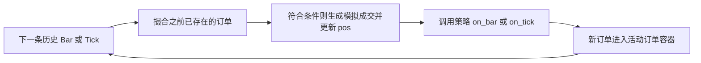

# CTA 策略与回测：从双均线读到成交假设

更新日期：2026-10-08。状态：静态源码学习笔记，数值均为教学假设；没有回测结果。

来源：[CTA 模块摘要](../sources/vnpy-ctastrategy.md)、[核心框架摘要](../sources/vnpy.md)。

## 策略模板先区分四种动作

| 方法 | 方向和开平含义 | 净持仓的变化由什么确认 |
| --- | --- | --- |
| `buy` | 买入开多：LONG + OPEN | 买入成交回报增加 `pos` |
| `sell` | 卖出平多：SHORT + CLOSE | 卖出成交回报减少 `pos` |
| `short` | 卖出开空：SHORT + OPEN | 卖出成交回报减少 `pos` |
| `cover` | 买入平空：LONG + CLOSE | 买入成交回报增加 `pos` |

“多”表示持有买入方向，“空”表示持有卖出方向；“开”建立仓位，“平”减少已有仓位。买卖方向与开平方向是两种属性。例如当前 `pos=-1`，买入平空 1 手成交后变为 0；再买入开多 1 手成交后变为 1。

依据：[CtaTemplate](../../raw/vnpy_ctastrategy/vnpy_ctastrategy/template.py)，143–253 行；[实盘成交处理](../../raw/vnpy_ctastrategy/vnpy_ctastrategy/engine.py)，196–221 行。真实开平请求还要经过账户持仓转换，净持仓的教学例子不能覆盖所有账户情形。

## 已初始化不等于正在交易

`inited` 表示策略初始化标志，`trading` 控制模板能否发单，`pos` 是策略净持仓。实盘初始化调用 `on_init`、恢复保存的变量、订阅合约行情；启动调用 `on_start` 后设置 `trading=True`；停止包含 `on_stop`、设置 False、撤单和保存变量。

已初始化的策略可以继续收到 Tick，即使 `trading=False`。而 `on_start` 调用时，框架尚未完成后面的 `trading=True` 赋值。因此不能假定在 `on_start` 中直接调用模板 `buy` 就会成功发单。依据：[生命周期](../../raw/vnpy_ctastrategy/vnpy_ctastrategy/engine.py)，149–162、679–756 行；[模板发送条件](../../raw/vnpy_ctastrategy/vnpy_ctastrategy/template.py)，233–253 行。

这些是正常路径的代码顺序。回调异常被捕获后，初始化/启动代码仍存在后续赋值，不能把异常处理简化成“最终状态一定已安全停止”；应在隔离环境进一步验证。

## 双均线示例如何组织代码

[DoubleMaStrategy](../../raw/vnpy_ctastrategy/vnpy_ctastrategy/strategies/double_ma_strategy.py) 默认快线窗口 10、慢线窗口 20；窗口决定用多少根 K 线计算平均值。它的实际路径是：

```text
on_init：创建 BarGenerator 与 ArrayManager，load_bar(10) 加载历史资料
on_tick：BarGenerator.update_tick，把行情更新聚合成一分钟 K 线
on_bar：cancel_all → 更新 ArrayManager → 检查 am.inited
        → 计算快慢均线 → 判断交叉 → 根据 pos 开平仓
```

`load_bar(10)` 的 10 是历史天数，不是 10 根 K 线。模板读取引擎返回的数据后逐条调用回调。`ArrayManager()` 的默认容量是 100，收满后才标为 `inited`；因此慢均线窗口是 20，并不意味着示例仅收到 20 根 K 线就进入交易逻辑。依据：[模板 load_bar](../../raw/vnpy_ctastrategy/vnpy_ctastrategy/template.py)，292 行起；[ArrayManager](../../raw/vnpy/vnpy/trader/utility.py)，504–550 行。

K 线通常在收到下一分钟 Tick 时由聚合器回调输出，不能假设单靠事件引擎每秒的定时事件就会自动生成每一根 K 线。依据：[BarGenerator.update_tick](../../raw/vnpy/vnpy/trader/utility.py)，211 行起。

## 用两个时刻解释交叉

教学例子：上一根 K 线时快均线 99、慢均线 100；当前快均线 101、慢均线 100。前一刻快线严格小于慢线、当前严格大于，满足示例的 `cross_over`。

若 `pos=0`，示例买入开多 1 手；若 `pos<0`，示例依次发买入平空 1 手和买入开多 1 手。这里发出两次请求，并没有等待平空成交后再发第二笔，因此真实成交顺序和风险约束不能从函数调用顺序直接保证。相等时也不满足示例使用的严格交叉条件。

依据：[double_ma_strategy.py](../../raw/vnpy_ctastrategy/vnpy_ctastrategy/strategies/double_ma_strategy.py)，65–101 行。示例策略只用固定 1 手，不能直接推广为任意已有持仓数量的完整仓位管理。

## 回测复用模板，但更换了引擎

回测由 `BacktestingEngine` 创建策略实例，初始化并开始历史回放；策略依然调用 `buy/sell/...`，请求最终留在本地活动订单容器。历史行情触发 `cross_limit_order/cross_stop_order`，生成模拟订单与成交，更新 `pos`，然后调用策略回调，整个过程不通过 CTP。

依据：[BacktestingEngine.add_strategy/run_backtesting/send_order](../../raw/vnpy_ctastrategy/vnpy_ctastrategy/backtesting.py)，157–162、219–255、899 行起。



图表示一般回放循环：`new_bar/new_tick` 先撮合，再把该行情交给策略。通常在 `on_bar` 中新下的订单从下一根 Bar 才开始参与撮合，而不是立刻用刚看完的同一根 K 线成交。依据：同文件 666–686 行；[上游测试](../../raw/vnpy_ctastrategy/tests/test_backtesting.py)，`NextBarCrossStrategy` 与 `TestBacktestingCross`。

## 一个能手算的撮合例子

教学假设：在 B0 的 `on_bar` 下限价买单，价格 100、数量 10。下一根 B1 为开盘 98、最高 103、最低 97、收盘 101。

BAR 模式买单检查 `order.price >= bar.low_price > 0`，这里 100 >= 97，满足条件；成交价为 `min(委托价, 开盘价)=98`。代码把 `order.traded` 直接设为整个委托量 10，并发全量成交回报，不根据 B1 的成交量分配可成交手数。卖单检查委托价不高于最高价，成交价取 `max(委托价, 开盘价)`。

TICK 模式的限价单使用卖一/买一判断，但同样没有根据卖一/买一数量模拟部分成交。依据：[cross_limit_order](../../raw/vnpy_ctastrategy/vnpy_ctastrategy/backtesting.py)，688–760 行。上游测试中的例子用于核查实现，本次没有执行测试，也没有将手算例子称为回测实验。

## 成本怎样进入收益

`DailyResult.calculate_pnl` 把持仓收益和当日交易收益相加，再扣手续费与滑点。该版本的单笔手续费按成交金额乘费率计算；滑点成本按成交量 × 合约乘数 × 配置滑点计算，作为费用扣除，不是在限价撮合函数中改写成交价。

教学假设：开盘前持仓为 0，当日买入 2 手，成交价 100、收盘 105、合约乘数 10、费率 0.001、滑点 0.2。交易盈亏为 `2×(105−100)×10=100`，手续费 `2×10×100×0.001=2`，滑点 `2×10×0.2=4`，当日净盈亏为 94。这个持仓尚未平掉，例子是当日盯市计算，不是完整往返交易收益。

依据：[DailyResult.calculate_pnl](../../raw/vnpy_ctastrategy/vnpy_ctastrategy/backtesting.py)，1110–1154 行。实际市场费用规则与参数校准仍需另外提供证据。

## 需要留在脑中的区别

| 维度 | 实盘 `CtaEngine + CTP` | 本地 `BacktestingEngine` |
| --- | --- | --- |
| 输入 | 网络回调转换成事件 | 历史数据顺序回放 |
| 成交 | 等待外部成交回报，可分笔 | 价格满足条件后直接全量模拟成交 |
| 撤单 | 发请求、等回报 | 本地修改状态并回调 |
| 持仓 | 对归属于策略的成交去重后更新 | 模拟撮合更新 |
| 成本 | 需要柜台/账户资料与实际核对 | 按配置计算费用和滑点成本 |

表只比较已读的实现路径，不宣称实盘容错、账户风控或回测精度已经验证。

理解检查：为什么“慢均线 20”不等于“预热 20 根”？为什么在当前 Bar 的回调里下单，通常要等下一根 Bar？为什么回测 10 手全部成交不能证明真实盘口也能成交 10 手？

相关：[架构总览](veighna-architecture.md) · [订单生命周期](veighna-order-lifecycle.md) · [待解问题](../questions.md) · [总索引](../index.md)
