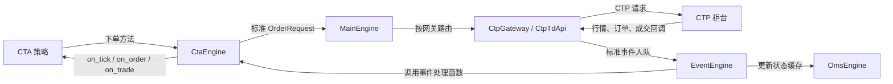

# VeighNa 三模块架构：从一个交易意图开始

更新日期：2026-10-08。状态：固定源码版本下的主链路阅读笔记；无运行验证。

来源：[vnpy 4.5.0](../sources/vnpy.md)、[vnpy_ctp 6.7.11.5](../sources/vnpy-ctp.md)、[vnpy_ctastrategy 1.5.0](../sources/vnpy-ctastrategy.md)。

## 先用一个例子分清职责

教学例子：某策略根据行情希望买入 10 手合约，但最后只成交了 6 手。

- `vnpy_ctastrategy` 回答“什么时候买、用什么策略参数、这个策略现在持有多少”。
- `vnpy` 提供标准数据对象、网关与应用的组织方式，以及事件分发和状态缓存。
- `vnpy_ctp` 把标准请求转成 CTP 字段，并将收到的行情、订单状态和成交转换回来。

这 10 手是请求数量，6 手是实际成交数量；只有成交回报才能驱动策略持仓更新。这里的数值是教学假设，模块职责来自上述源码。

## 先认识几个名字

| 名词 | 定义与作用 |
| --- | --- |
| 事件 | 带类型和数据的消息，例如“新 Tick”或“新成交” |
| 引擎 | 负责某类业务的对象；主引擎组织接口和应用，CTA 引擎管理策略 |
| 网关 | 统一交易接口的适配对象；这里的 `CtpGateway` 对接 CTP |
| 回调 | 新事件到来时，由框架主动调用的方法，例如 `on_tick` |
| OMS | 订单管理系统；本版本缓存订单、成交、持仓、账户等状态 |
| Tick | 一次行情更新，不保证等于一笔逐笔成交 |
| Bar / K 线 | 一个时间区间内汇总的开、高、低、收等行情信息 |

数据对象与事件的定义见 [object.py](../../raw/vnpy/vnpy/trader/object.py)、[event/engine.py](../../raw/vnpy/vnpy/event/engine.py)；OMS 实现见 [trader/engine.py](../../raw/vnpy/vnpy/trader/engine.py)，375 行起。

## 指令向外，回报向内

图将外部行情与交易服务合并为“CTP 柜台”以说明总体方向；源码中行情实际走 `CtpMdApi`、交易走 `CtpTdApi`。下单是方法调用链，回报进入事件队列，是两种方向不同的路径。依据：[CTA send_server_order](../../raw/vnpy_ctastrategy/vnpy_ctastrategy/engine.py)，287–341 行；[MainEngine.send_order](../../raw/vnpy/vnpy/trader/engine.py)，265–275 行；[CTP 网关](../../raw/vnpy_ctp/vnpy_ctp/gateway/ctp_gateway.py)；[事件分发](../../raw/vnpy/vnpy/event/engine.py)，68–80 行。

## 平台如何装配

按 [官方启动示例](../../raw/vnpy/examples/veighna_trader/run.py) 阅读：创建事件引擎 → 创建主引擎 → `add_gateway(CtpGateway)` → `add_app(CtaStrategyApp)` → 创建主窗口。

注意这里的“添加”是注册和构造。`MainEngine.connect` 才调用网关连接；CTA 的 `init_engine` 在 [CtaManager 构造](../../raw/vnpy_ctastrategy/vnpy_ctastrategy/ui/widget.py)，42 行被调用。之后还要分别添加、初始化和启动具体策略。不能把“界面窗口打开了”当作“策略已经可以交易”。

官方启动示例还导入 `vnpy_ctabacktester` 与 `vnpy_datamanager`，它们不属于本次下载范围。`vnpy_ctastrategy` 自带回测引擎，但图形化回测应用是另外的模块。默认数据库驱动 `vnpy_sqlite` 也需要另外提供；因此三个目录不是完整运行环境。依据：[启动示例](../../raw/vnpy/examples/veighna_trader/run.py)、[数据库加载器](../../raw/vnpy/vnpy/trader/database.py)、[CTA backtesting.py](../../raw/vnpy_ctastrategy/vnpy_ctastrategy/backtesting.py)。

## 阅读顺序与理解检查

1. 阅读三个 [来源摘要](../sources/vnpy.md)，先知道对象由哪个模块提供。
2. 阅读 [订单生命周期](veighna-order-lifecycle.md)，跟踪请求、订单号、回报与持仓。
3. 阅读 [CTA 策略与回测](cta-strategy-and-backtesting.md)，把指标、策略状态和撮合条件连起来。

理解检查：策略发出买入请求时，哪一层决定买卖？哪一层翻译 CTP 字段？哪一层实际更新策略的 `pos`？能从源码回答这三个问题，再继续运行与实验。

相关：[系统学习入口](trading-system.md) · [待解问题](../questions.md) · [总索引](../index.md)

进一步按底层接口、中层引擎和策略应用展开，见 [系统分层与三类策略](veighna-system-layers.md)。
