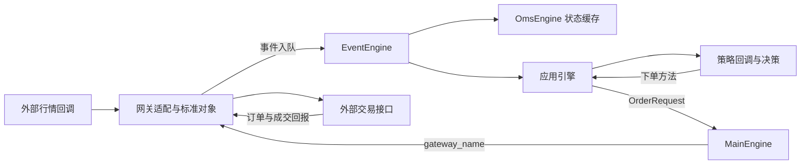

# VeighNa 系统分层：从底层回调到策略应用

更新日期：2026-10-08。状态：源码与官方文档支持的学习讲义；数值是教学假设，没有运行新策略或验证收益。

来源：本仓库固定的 [vnpy 4.5.0](../sources/vnpy.md)、[vnpy_ctp 6.7.11.5](../sources/vnpy-ctp.md)、[vnpy_ctastrategy 1.5.0](../sources/vnpy-ctastrategy.md)。组合与价差应用依据 2026-10-08 查阅的官方在线文档/源码；这两个模块尚未下载到 `raw/`，在线分支会变化，不等同于本地固定版本。

## 一个例子贯穿三层

教学假设：合约 A 最新价从 99 变为 101。策略规则为“最新价大于 100 时，买入开仓 2 手”，柜台只回报成交 1 手。

| 层次 | 负责什么 | 在这个例子中的动作 |
| --- | --- | --- |
| 底层接口 | 翻译外部协议，提供一致的数据和操作入口 | 将 CTP 行情字典转换为 `TickData`；将标准下单请求转换为 CTP 请求 |
| 中层引擎 | 分发事件、缓存状态、路由指令 | 分发最新价 101 的行情；缓存订单与成交；把请求交给对应网关 |
| 策略应用 | 判断机会、设定目标、管理策略自己的状态 | 判断超过 100；提出买入 2 手；收到归属该策略的 1 手成交后更新持仓 |

下单数量 2、成交数量 1、尚未成交数量 1，分别表示意图、事实和剩余工作。统一接口没有消除这些区别。



图表示框架组织，不代表全部动作在同一线程或同一时刻完成。指令沿方法调用链向外，回报沿事件总线向内。

## 底层接口：数据结构标准化

标准化是把各家接口不同的字段、编号和枚举转换为应用共同理解的对象。原始 CTP 用 `LastPrice`，VeighNa 的策略统一读取 `tick.last_price`；交易所和时间信息也由网关处理，而不由每个策略重复解析。

| 标准对象 | 表示什么 | 不应混淆的对象 |
| --- | --- | --- |
| `TickData` | 一次行情更新，包括最新价和盘口 | 不一定是一笔逐笔成交，也不保证每次最新价都变化 |
| `BarData` | 某个时间段的开、高、低、收等信息 | 与一个瞬时 Tick 不同 |
| `ContractData` | 合约元信息，例如乘数、价格跳动、交易所 | 不是行情，也不是持仓 |
| `OrderRequest` | 希望发送的委托 | 不是交易所已接受的订单 |
| `OrderData` | 一张订单的最新状态和累计成交数量 | 不是某一笔成交明细 |
| `TradeData` | 一笔实际成交的价格和数量 | 同一订单可以有多笔成交 |
| `PositionData` / `AccountData` | 网关报告的持仓 / 账户状态 | 不等于某一个策略的内部持仓 |

统一标识 `vt_symbol = symbol + '.' + exchange`，例如 `rb2701.SHFE`；订单和成交还带网关名前缀，便于区分接口来源。`Direction` 表示买卖方向，`Offset` 表示开仓或平仓，两者分开：买入开多和买入平空都属于买入方向，业务含义却不同。

源码入口：[object.py](../../raw/vnpy/vnpy/trader/object.py) 的各个 Data/Request 类；[constant.py](../../raw/vnpy/vnpy/trader/constant.py) 的 `Direction/Offset/Status`；[CTP onRtnDepthMarketData/onRspQryInstrument](../../raw/vnpy_ctp/vnpy_ctp/gateway/ctp_gateway.py)。CTP 网关会先查合约映射；缺少时间或尚无合约信息的行情在该实现中会被过滤。标准化包括必要的数据清理，并非只改字段名。

## 底层接口：业务流程标准化

数据标准化统一“消息长什么样”，业务标准化统一“怎样操作、怎样报告结果”。上层使用 `connect/subscribe/send_order/cancel_order/query_account/query_position` 等共同方法，网关负责与外部接口对应；外部结果通过 `on_tick/on_order/on_trade/...` 推送。

例如 CTP 交易通道要连接、认证、登录、确认结算、查询合约；另一接口可能没有认证或结算步骤。上层依赖统一网关入口，具体准备工作仍由各网关负责，不能认为所有柜台的登录顺序完全相同。

订单状态用 `SUBMITTING/NOTTRADED/PARTTRADED/ALLTRADED/CANCELLED/REJECTED` 表达。它们不是必须逐项走完的固定序列：订单可能拒绝、分笔成交，或成交一部分后撤掉剩余量。发出撤单请求时，订单仍可能继续成交，必须等实际回报。

统一接口也不意味着所有接口都支持同一种订单类型。合约能力、最小价格跳动、最小交易量与外部限制仍需检查。CTA 发送请求还会通过持仓转换器处理开平请求；直接调用 `MainEngine.send_order` 不会自动运行 CTA 的完整前处理链。

源码入口：[BaseGateway 方法和约定](../../raw/vnpy/vnpy/trader/gateway.py)；[CTP 登录与订单回报](../../raw/vnpy_ctp/vnpy_ctp/gateway/ctp_gateway.py)；[CTA send_server_order](../../raw/vnpy_ctastrategy/vnpy_ctastrategy/engine.py)；[持仓转换](../../raw/vnpy/vnpy/trader/converter.py)。

## 中层引擎：事件引擎总线

事件是“类型 + 数据”，例如 `Event(EVENT_TICK, tick)`；事件总线负责把消息送给订阅这种类型的处理函数。

```text
register(EVENT_TICK, handler)   # 告诉总线：有行情时调用 handler
put(Event(EVENT_TICK, tick))   # 把行情放入队列
工作线程取出事件 → 依次调用注册的处理函数
```

这里的“订阅事件”是本地注册处理函数，与向柜台订阅合约行情是两件事。网关收到数据后入队，OMS、应用引擎和界面可以各自监听。CTA 引擎还会根据 `vt_symbol` 找到相关策略，再调用策略的 `on_tick`。

本版本使用进程内队列与工作线程，处理函数在分发线程中依次执行；不是每条行情都新开线程，也不是跨服务器的消息中间件。耗时策略回调会拖慢后续事件，所以不应在回调内长时间等待网络请求。定时线程默认每秒放入定时事件，可用于周期性任务。

源码入口：[EventEngine._run/_process/register/put](../../raw/vnpy/vnpy/event/engine.py)；[BaseGateway.on_event/on_tick](../../raw/vnpy/vnpy/trader/gateway.py)；[CtaEngine.process_tick_event](../../raw/vnpy_ctastrategy/vnpy_ctastrategy/engine.py)。网关同时推送通用事件和特定对象事件；同时监听二者时要注意重复处理同一数据。

## 中层引擎：OMS 数据缓存

OMS 是 Order Management System，订单管理系统。本版本的 `OmsEngine` 除订单外，还缓存最新行情、成交、持仓、账户和合约；可以理解为应用查询当前已知状态的公共入口。

| 查询 | 在教学例子中看到什么 |
| --- | --- |
| `get_tick(vt_symbol)` | 最近已处理的一条行情，最新价为 101 |
| `get_order(vt_orderid)` | 委托量 2、累计成交量 1 的最新订单状态 |
| `get_trade(vt_tradeid)` | 本次实际成交 1 手的成交明细 |
| `get_all_active_orders()` | 仍在等待成交或部分成交的活动委托 |
| `get_position(vt_positionid)` | 最近网关持仓回报中的状态，可能尚未刷新 |

Tick 和订单字典保存每个键的最新对象；成交以成交 ID 保存。活动订单会在订单结束后从活动集合移除，但仍留在订单缓存中。OMS 还向持仓转换器传递订单、成交和持仓信息，以维护开平转换所需状态。

应区分三个数量：策略希望持有的目标仓位、策略成交回报累计的逻辑持仓、柜台报告的账户持仓。多个策略和手工交易可以共用一个账户，因此后两者可能不同。CTA 根据订单号找到所属策略，过滤重复成交，再更新它的 `pos`；不能把账户的全部持仓直接算给一个策略。

缓存是“最近已处理的报告”，不保证实时无延迟，也不替代历史数据库、重启恢复或账户核对。不要在发出下单请求时把持仓直接改成目标值。

源码入口：[OmsEngine.process_* / get_*](../../raw/vnpy/vnpy/trader/engine.py)；[CtaEngine.process_order_event/process_trade_event](../../raw/vnpy_ctastrategy/vnpy_ctastrategy/engine.py)。

## 中层引擎：交易指令路由

路由就是把请求送到正确的接口。`MainEngine` 保存 `gateway_name → gateway` 映射；发送时找到网关，再调用它的 `send_order`。

```text
策略 buy(price, volume)
  → CtaEngine 创建 OrderRequest、转换开平请求
  → MainEngine.send_order(request, contract.gateway_name)
  → 对应网关 send_order
  → CTP reqOrderInsert
```

它解决“走哪个网关”，不会自动比较多个柜台的价格并挑选最佳执行场所；后者需要另行实现。撤单也必须送到原订单所属的网关。

请求返回订单 ID 后，应用引擎保存“订单 ID → 策略”的关系，后续回报才能送回正确策略。返回 ID 表示框架可追踪该请求，不表示已经成交。

源码入口：[MainEngine.send_order/cancel_order](../../raw/vnpy/vnpy/trader/engine.py)；[CtaEngine.send_server_order](../../raw/vnpy_ctastrategy/vnpy_ctastrategy/engine.py)；[CtpTdApi.send_order](../../raw/vnpy_ctp/vnpy_ctp/gateway/ctp_gateway.py)。

## 策略应用：单标的时序策略

“标的”是交易对象，“时序”是按时间排列的观测。单标的时序策略根据一个交易对象过去和现在的数据决策，例如 A 的最近若干根 K 线均价、A 的价格突破。

在 CTA 中，一个策略实例绑定一个 `vt_symbol`，主要入口为 `CtaTemplate.on_tick/on_bar`。引擎负责初始化、启动、停止、分配行情和订单/成交回报；策略负责判断条件与提出交易意图。

教学例子：A 最新价 99、100、101，规则“最新价严格大于 100 时买入”在 101 时满足。若规则改为“从不高于 100 的区域上穿 100”，则还要保存前一个价格；启动时第一条行情就是 101，两种规则的处理会不同。策略不仅是一个条件，还要说明何时允许再次触发、数量、退出条件和未成交订单如何处理。

同一 CTA 模板可以配置多个实例分别交易不同合约，但各实例并不会因此自动共同管理一个组合预算。源码入口：[CtaTemplate](../../raw/vnpy_ctastrategy/vnpy_ctastrategy/template.py)、[双均线示例](../../raw/vnpy_ctastrategy/vnpy_ctastrategy/strategies/double_ma_strategy.py)。更多细节见 [CTA 与回测笔记](cta-strategy-and-backtesting.md)。

## 策略应用：多标的投组策略

“投组”即投资组合。一个策略实例管理多个合约，综合计算它们的信号与目标持仓。它可以做同一时点的强弱比较，也可以为多个标的分别算趋势后统一配置；不只限于横截面选强弱。

教学假设：A/B/C 的当前策略持仓为 `{A:1, B:2, C:0}`，目标为 `{A:2, B:0, C:1}`。若无挂单和冻结、当前均为多仓，则需要 A 买入开仓 1、B 卖出平仓 2、C 买入开仓 1。这是目标到委托的差量计算，不能把目标字典直接当作已成交持仓。

VeighNa 的 `vnpy_portfoliostrategy` 使用 `StrategyTemplate`、`vt_symbols`、逐合约持仓/目标字典，以及 `on_bars(bars)` 接收 K 线切片。`set_target` 设置目标，`rebalance_portfolio` 计算仓差、发开平请求。当前在线实现只对本次切片里有 Bar 的标的调仓；输入缺失时不能假定所有标的都有最新数据。

框架提供管理和执行工具，资金分配、合约乘数、组合敞口与风险约束仍由具体策略设计。不同合约各买 1 手不意味着金额相同或风险相同。

依据：[官方 PortfolioStrategy 文档](https://www.vnpy.com/docs/cn/community/app/portfolio_strategy.html) 的“策略回调/持仓目标调仓”；[官方 StrategyTemplate 源码](https://raw.githubusercontent.com/vnpy/vnpy_portfoliostrategy/main/vnpy_portfoliostrategy/template.py) 的 `update_trade/set_target/rebalance_portfolio`。在线实现先请求撤掉活动订单再计算新委托；调用顺序不保证旧单已撤销，需要核对具体执行与竞态行为，未在本仓库运行验证。

## 策略应用：价差套利类策略

“腿”是组合交易中的一项标的。价差策略针对多个标的的相对价格，例如构建 `S=A-B`，买入价差表示买 A、卖 B。套利类名称不表示获利无风险，关系可能变化，分腿成交也有执行风险。

教学假设：A/B 使用相同报价单位、相同合约规模，交易数量比 1:1，盘口如下：

| 标的 | 买一 | 卖一 |
| --- | --- | --- |
| A | 101 | 102 |
| B | 98 | 99 |

买入 `A-B` 需要买 A、卖 B，盘口参考成本为 `102-98=4`；卖出价差需要卖 A、买 B，盘口参考价格为 `101-99=2`。两个标的的最新价相减不能代替可交易的双边盘口；这些盘口也不保证实际成交，数量和变化速度仍有影响。

`vnpy_spreadtrading` 把腿数据组合为 `SpreadData`。策略决定是否启动价差交易；执行算法管理各腿订单、成交和对冲。官方示例采用主动腿先成交、被动腿随后对冲，算法还要判断腿间成交是否平衡。

若主动腿成交 1 手而被动腿未成交，就暂时持有单边敞口。必须跟踪实际腿成交，不能把“已发出两张订单”当作“完成一份价差”。定价公式与交易手数比例也是不同配置；合约规模不同，不能直接照搬价格系数作为下单手数。

依据：[官方 SpreadTrading 文档](https://www.vnpy.com/docs/cn/community/app/spread_trading.html) 的“构建/监控价差、手动交易”；[SpreadData.calculate_price](https://raw.githubusercontent.com/vnpy/vnpy_spreadtrading/main/vnpy_spreadtrading/base.py)；[SpreadAlgoTemplate.update_trade/is_hedge_finished](https://raw.githubusercontent.com/vnpy/vnpy_spreadtrading/main/vnpy_spreadtrading/template.py)。这里讨论应用层合成价差，不假定它等同于交易所原生组合委托或具有原子成交保证。

## 三类策略怎样选择

| 应用 | 一个实例管理的对象 | 主要问题 | 代表模块 |
| --- | --- | --- | --- |
| 单标的时序 | 一个合约及其历史序列 | 这个标的何时开平仓 | `vnpy_ctastrategy` |
| 多标的组合 | 一组标的和逐标的目标仓位 | 如何共同决定并执行多个仓位 | `vnpy_portfoliostrategy` |
| 价差套利 | 定价关系、各条腿与执行任务 | 价差是否满足条件，怎样成交并对冲 | `vnpy_spreadtrading` |

分类有重叠：配对交易也能用组合策略表达；价差应用则额外提供合成盘口与专门的腿执行管理。应根据状态和执行需求选工具，不能只按“有几个合约”判断。

## 学习顺序与理解检查

1. 从 CTP 字典到 `TickData`：找出最新价、时间、交易所和 `vt_symbol` 的来源。
2. 从 `gateway.on_tick` 到事件队列：追踪 OMS 与 CTA 如何各自收到行情。
3. 从 `buy` 到 `reqOrderInsert`：追踪请求结构、网关选择和订单归属。
4. 从两笔成交回报到持仓：解释买入 2 手分成两次 1 手成交时，订单和策略持仓怎样变化。
5. 把一个净持仓换成多个目标仓位，再把多个独立仓位换成必须协调成交的价差腿。

理解检查：OMS 里的账户持仓为什么可能与策略 `pos` 不同？订阅了三个行情为什么仍不一定是组合策略？为什么价差 `A-B` 的买入成本要用 A 卖一减 B 买一？

相关：[架构总览](veighna-architecture.md) · [订单生命周期](veighna-order-lifecycle.md) · [学习路线](../roadmap.md) · [总索引](../index.md)
